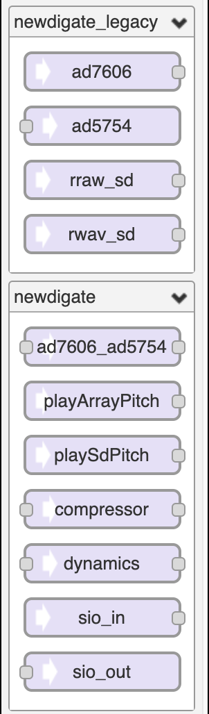

# Audio System Design Tool + extras 

Based on [Teensy Audio System Design Tool](http://www.pjrc.com/teensy/gui/index.html)

Online editor: [teensy-eurorack-audio-gui](https://newdigate.github.io/teensy-eurorack-audio-gui)

------------------------

## audio components
* AudioInputSharedAD7606 [teensy-audio-ad5754-ad7606](https://github.com/newdigate/teensy-audio-ad5754-ad7606) 
* AudioOutputSharedAD5754Dual [teensy-audio-ad5754-ad7606](https://github.com/newdigate/teensy-audio-ad5754-ad7606)
* AudioInputOutputSPI [teensy-eurorack](https://github.com/newdigate/teensy-eurorack) [*](https://github.com/newdigate/teensy-eurorack/blob/master/software/src/input_output_spi.h)
* AudioPlayArrayResmp [teensy-variable-playback](https://github.com/newdigate/teensy-variable-playback)
* AudioPlaySdRawResmp [teensy-variable-playback](https://github.com/newdigate/teensy-variable-playback)
* AudioPlaySdWavResmp [teensy-variable-playback](https://github.com/newdigate/teensy-variable-playback)
* AudioEffectCompressor [teensy-audio-compressor-effect](https://github.com/newdigate/teensy-audio-compressor-effect)
* AudioEffectDynamics [AudioEffectDynamics](https://github.com/newdigate/AudioEffectDynamics)
------------------------

## links
* based on [teensy audio gui](http://www.pjrc.com/teensy/gui/index.html)
* forked github repo [PaulStoffregen/Audio](https://github.com/PaulStoffregen/Audio)
* docs [td_libs_Audio](http://www.pjrc.com/teensy/td_libs_Audio.html)

------------------------
